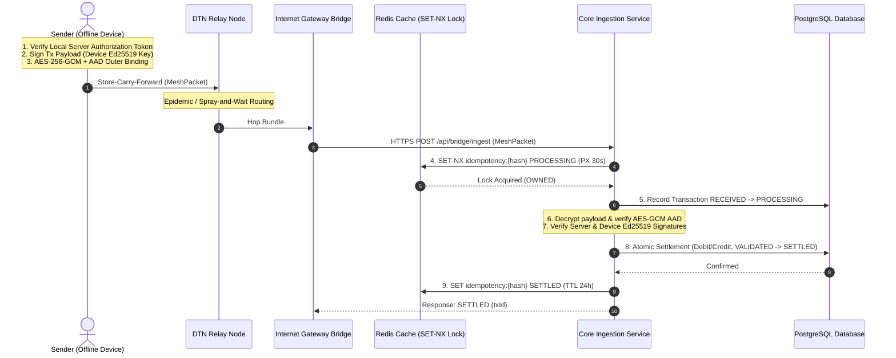

# UPI Offline Mesh: Decentralized Asynchronous Settlement Protocol

A production-oriented Spring Boot backend & event-driven DTN simulator demonstrating a **cryptographically authenticated pre-funded offline wallet protocol** routed over Delay/Disruption Tolerant Networks (DTN) with **Redis distributed idempotency** and **PostgreSQL durable settlement persistence**.

---

## 1. System Architecture



---

## 2. Quick Start & Local Setup

### Option A: Docker Compose (Production Stack)
To run the application alongside **PostgreSQL 16** and **Redis 7**:

```bash
docker-compose up --build
```
* **Application Dashboard**: [http://localhost:8080](http://localhost:8080)
* **PostgreSQL Database**: `localhost:5432` (`db: upimesh`, `user: postgres`)
* **Redis Cache**: `localhost:6379`

### Option B: Local Maven Build
```bash
# Build and run tests
./mvnw clean test

# Run application locally
./mvnw spring-boot:run
```

---

## 3. Database Schema & Persistence Architecture

The persistence layer uses **PostgreSQL 16** managed via **Flyway Database Migrations** (`src/main/resources/db/migration/`).

### Production Domain Tables (9 Entities)

| Table Name | Primary Key | Description & Constraints |
| :--- | :--- | :--- |
| `accounts` | `vpa` (VARCHAR) | Ledger bank accounts. Contains `balance` (`NUMERIC(19,2)`), optimistic locking `version` (`BIGINT`), and audit timestamps. |
| `devices` | `device_id` (VARCHAR) | Client hardware device registry. Foreign key to `accounts(vpa)`. Holds device Ed25519 `public_key_base64`. |
| `wallet_authorizations` | `wallet_id` (VARCHAR) | Server-signed authorization tokens for offline spending. Foreign keys to `accounts` and `devices`. Stores `authorized_balance`, `expires_at`, and `server_signature`. |
| `wallet_spend` | `id` (BIGSERIAL) | Tracks individual offline wallet reservations and commitments. Foreign key to `wallet_authorizations`. Enforces `UNIQUE(transaction_id)`. |
| `transactions` | `id` (BIGSERIAL) | Central ledger of settlement transactions. Foreign keys to `accounts(vpa)`. Enforces `UNIQUE(packet_hash)`. Uses explicit `TransactionState` enum states. |
| `transaction_events` | `id` (BIGSERIAL) | Event stream tracking transaction state transitions (`RECEIVED -> PROCESSING -> VALIDATED -> SETTLED`). Foreign key to `transactions`. |
| `bridge_nodes` | `node_id` (VARCHAR) | Registry of DTN gateway bridge nodes uploading packets. Tracks `is_online`, `last_heartbeat`, and `total_uploads`. |
| `cryptographic_keys` | `key_id` (VARCHAR) | Metadata and public key registry for server and device encryption/signing keys (`algorithm`, `public_key_pem`, `status`). |
| `audit_records` | `id` (BIGSERIAL) | Append-only security audit log tracking cryptographically significant system events. |

---

## 4. Database Migration Workflow

Flyway automatically executes versioned SQL migration scripts on startup:

* **`V1__init_production_schema.sql`**: Creates all 9 production tables, primary/foreign key relationships, check constraints (`balance >= 0`, `amount > 0`), and performance indexes.
* **`V2__seed_dev_data.sql`**: Seeds default development accounts (`alice@demo`, `bob@demo`, `carol@demo`, `dave@demo`), device keypairs, and bridge nodes.

---

## 5. Configuration & Environment Variables

All database, cache, and security properties are externalized into environment variables with fallback defaults:

| Environment Variable | Default Value | Description |
| :--- | :--- | :--- |
| `SERVER_PORT` | `8080` | Application HTTP server port |
| `SPRING_DATASOURCE_URL` | `jdbc:postgresql://localhost:5432/upimesh` | Database JDBC URL |
| `SPRING_DATASOURCE_USERNAME` | `postgres` | Database username |
| `SPRING_DATASOURCE_PASSWORD` | `postgres_secret_password` | Database password |
| `REDIS_HOST` | `localhost` | Redis server hostname |
| `REDIS_PORT` | `6379` | Redis server port |
| `IDEMPOTENCY_TTL_SECONDS` | `86400` | Redis key TTL for settled packet hashes (24 hours) |
| `PROCESSING_LOCK_TTL_MS` | `30000` | Redis distributed lock TTL (30 seconds) |
| `STUCK_TIMEOUT_SECONDS` | `90` | Inactive `PROCESSING` threshold for stuck transaction recovery |

---

## 6. Backup & Disaster Recovery Considerations

### PostgreSQL Backup Strategy
1. **Automated Logical Backups (`pg_dump`)**:
   ```bash
   pg_dump -h localhost -U postgres -F c -b -v -f /backups/upimesh_$(date +%Y%m%d_%H%M%S).dump upimesh
   ```
2. **Point-In-Time Recovery (PITR)**: Enable Write-Ahead Logging (`wal_level = replica`) and continuous WAL archiving to Amazon S3 / Google Cloud Storage.
3. **Database Restores**:
   ```bash
   pg_restore -h localhost -U postgres -d upimesh -v /backups/upimesh_20260831_120000.dump
   ```

### Redis Cache Recovery & High Availability
* **Persistence**: Configured with both **RDB snapshots** (`save 60 1000`) and **Append-Only File (AOF)** (`appendonly yes`) to prevent loss of in-flight distributed locks.
* **Master-Replica HA**: Deploy Redis Sentinel or Redis Cluster in multi-AZ cloud deployments.

---

## 7. API Reference

| Verb | Endpoint | Description |
| :--- | :--- | :--- |
| `POST` | `/api/bridge/ingest` | Central ingestion endpoint for DTN bridge nodes uploading `MeshPacket` bundles |
| `GET` | `/api/mesh/strategy` | Returns active DTN routing algorithm (`EPIDEMIC` or `SPRAY_AND_WAIT`) |
| `POST` | `/api/mesh/strategy` | Switches active DTN routing algorithm (`{"strategy": "SPRAY_AND_WAIT"}`) |
| `GET` | `/api/mesh/dtn-metrics` | Returns detailed DTN simulation metrics report |
| `GET` | `/api/accounts` | Lists ledger account balances |
| `GET` | `/api/transactions` | Lists historical settled transactions |
