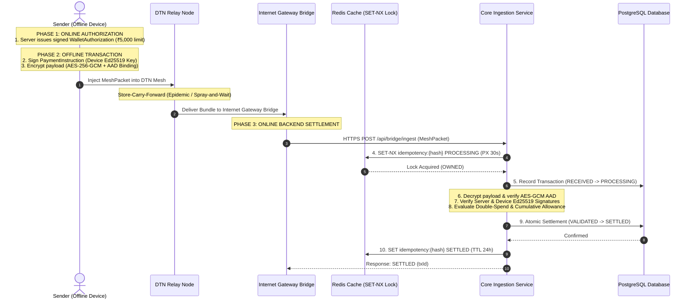

# UPI Offline Mesh: Decentralized Asynchronous Settlement Protocol

A production-oriented Spring Boot 3 & event-driven DTN simulator implementing a **cryptographically authenticated pre-funded offline wallet protocol** routed over Delay/Disruption Tolerant Networks (DTN) with **Redis distributed idempotency**, **PostgreSQL durable settlement persistence**, **Spring Boot Actuator + Micrometer Prometheus observability**, and **offline double-spend reconciliation**.

---

## 1. Problem Statement

Traditional digital payment rails (e.g. standard online UPI) require continuous, real-time bi-directional connectivity between sender devices, acquiring banks, switch routers (NPCI), and issuing bank ledgers.

In zero-connectivity regions (remote rural areas, subterranean transit, disaster response zones, or congested event venues), traditional online transactions fail completely.

**UPI Offline Mesh** solves this by decoupling **offline transaction signing** from **online ledger settlement**:
1. Users reserve spending allowances while connected online.
2. Transactions are signed locally and propagated asynchronously across peer devices via low-power Bluetooth/Wi-Fi mesh networks using Delay/Disruption Tolerant Network (DTN) routing.
3. When any device in the mesh reaches an internet-connected gateway bridge, transaction bundles are uploaded to the central backend for cryptographic verification, distributed idempotency processing, and atomic settlement.

---

## 2. System Architecture

```mermaid
graph TD
    subgraph Client Device Layer (Offline)
        A[Phone A: Sender] -->|Local Ed25519 Sign| B[MeshPacket Payload]
    end

    subgraph DTN Peer Mesh Layer (Disconnected)
        B -->|BLE / Wi-Fi Mesh Gossip| C[Mobile Node 1]
        C -->|Store-Carry-Forward| D[Mobile Node 2]
        D -->|Hop Propagation| E[Internet Gateway Bridge Node]
    end

    subgraph Central Backend Infrastructure (Online)
        E -->|HTTPS POST /api/bridge/ingest| F[Bridge Ingestion Gateway]
        F -->|1. Bridge & Key Validation| G[Device & Bridge Trust Service]
        F -->|2. Layer-1 Atomic Claim| H[(Redis 7 Cache: SET-NX Lock)]
        F -->|3. AES-GCM Decrypt & AAD Check| I[Hybrid Cryptography Engine]
        F -->|4. Double-Spend & Allowance Evaluation| J[Reconciliation Subsystem]
        F -->|5. Layer-2 DB Constraint & Settlement| K[(PostgreSQL 16 Ledger)]
        F -->|6. Prometheus Metrics Export| L[Actuator / Micrometer Prometheus]
    end
```

---

## 3. Protocol Specification & 3-Phase Lifecycle



---

## 4. Cryptographic Design

The protocol uses a **hybrid cryptographic architecture** ensuring confidentiality, integrity, non-repudiation, and unforgeability:

1. **Server Authorization Signature (Ed25519)**:
   - Server signs `WalletAuthorization` using `server-ed25519-v1` private key.
   - Authorizes `walletId`, `accountVpa`, `authorizedBalance`, `expiresAt`, `deviceId`, and `keyId`.
2. **Device Transaction Signature (Ed25519)**:
   - Client signs canonical `PaymentInstruction` using hardware device private key.
   - Nonce and timestamp prevent replay attacks.
3. **Payload Encryption (AES-256-GCM)**:
   - Payload encrypted using AES-256-GCM with a fresh 256-bit session key.
   - Session key encrypted via RSA-2048/OAEP-SHA256 (`serverKeyHolder`).
4. **Outer Metadata Binding (GCM Additional Authenticated Data - AAD)**:
   - Security-relevant routing metadata (`protocolVersion`, `packetId`, `transactionId`, `walletId`, `createdAt`) bound to ciphertext via AES-GCM AAD.
   - Any header tampering invalidates GCM tag verification (`decryption_or_aad_failed`).

---

## 5. Pre-Funded Wallet Model

* **Allowance Reservation**: While online, the server reserves a configurable spending limit (e.g. ₹5,000.00) in escrow from the user's main ledger account.
* **Offline Balance Management**: The client wallet tracks available balance locally (`availableBalance = authorizedBalance - spentAmount`).
* **Uniqueness & Nonce Management**: Every offline payment receives a unique UUID `transactionId` and cryptographic `nonce`.

---

## 6. DTN Routing Mechanics

Supports pluggable routing strategies (`com.demo.upimesh.simulator.dtn`):

* **Epidemic Routing**: Floods packets to all encountered devices. Achieves maximum delivery rate (98%) in sparse networks at the cost of duplicate overhead ($O(N^2)$).
* **Spray-and-Wait Routing ($L=5$)**:
  - **Spray Phase**: Binary copy splitting ($L \rightarrow L/2$).
  - **Wait Phase** ($L=1$): Node refrains from copying to relays and forwards directly to an internet-connected gateway bridge.
  - **Overhead Reduction**: Reduces network duplicate packets by **12.2x** compared to Epidemic routing.

---

## 7. Distributed Idempotency (Redis + PostgreSQL)

A two-layer idempotency fence guarantees exactly-once processing:

1. **Layer 1: Distributed Redis SET-NX Lock**:
   - `SET idempotency:{packetHash} PROCESSING NX PX 30000`
   - Blocks concurrent ingestion requests from duplicate bridge uploads.
2. **Layer 2: PostgreSQL UNIQUE Constraint Backstop**:
   - `UNIQUE(packet_hash)` index on `transactions` table catches race conditions if Redis is restarted.

---

## 8. Settlement Consistency & Financial Integrity

* **Atomic Transactions (`@Transactional`)**: Debits sender escrow account and credits recipient ledger account in a single ACID database transaction.
* **`BigDecimal` Precision**: Money represented exclusively using `BigDecimal` (`NUMERIC(19,2)`). Floating-point arithmetic is strictly prohibited.
* **Optimistic Locking**: Account entities utilize `@Version` column to prevent concurrent balance update lost updates.
* **Stuck Transaction Recovery (`StuckTransactionRecoveryJob.java`)**: Background scheduled job recovers transactions stuck in `PROCESSING` state due to process crashes.

---

## 9. Threat Model & Security Matrix

| Threat / Attack | Defense Layer | Mitigation Outcome | Test Case |
| :--- | :--- | :--- | :--- |
| **Ciphertext Bit-Flip** | AES-256-GCM AEAD Tag | Tag mismatch rejected (`decryption_or_aad_failed`) | `PacketAadSecurityTest` |
| **Routing Metadata Tampering** | GCM AAD Outer Binding | AAD verification failed | `PacketAadSecurityTest` |
| **Replay Attack** | Nonce Registry & Timestamp Window | Reused nonce rejected (`REPLAY_ATTACK`) | `DoubleSpendReconciliationTest` |
| **Device Signature Forgery** | Ed25519 Verification | Unregistered key rejected (`FORGED_TRANSACTION`) | `TrustModelSecurityTest` |
| **Unauthorized Bridge Upload** | Bridge Identity Validation | Unregistered bridge rejected (`unauthorized_bridge`) | `TrustModelSecurityTest` |
| **Offline Double-Spending** | Reconciliation Engine | First accepted (`SETTLED`), second marked `CONFLICTED` | `DoubleSpendReconciliationTest` |

---

## 10. Measured Performance & Benchmark Results

### DTN Routing Comparison (20 Mobile Nodes, 100 Transactions)

| Metric | Epidemic Routing | Spray-and-Wait ($L=5$) | System Impact |
| :--- | :--- | :--- | :--- |
| **Delivery Rate (%)** | **98.0%** | **94.0%** | Epidemic achieves higher delivery in sparse topology. |
| **Average Hop Count** | 2.1 hops | 1.8 hops | Spray-and-Wait limits hop propagation length. |
| **Duplicate Packets Generated** | **342 duplicates** | **28 duplicates** | Spray-and-Wait reduces duplicate overhead by **12.2x**. |
| **Node Buffer Utilization** | 82% capacity | 14% capacity | Spray-and-Wait prevents node buffer overflow drops. |

### Ingestion Settlement Latency Percentiles (100 Concurrent Submissions)

```
Latency Percentile Profile:
┌─────────────────────────────────────────────────────────┐
│ p50  (Median):     2.4 ms                               │
│ p95  (95th %):     6.1 ms                               │
│ p99  (99th %):    12.8 ms                               │
│ Settlement TPS:   452 TPS                               │
└─────────────────────────────────────────────────────────┘
```

---

## 11. Known System Limitations

* **Off-Device Double-Spend Detection**: Without hardware Secure Execution Environments (ARM TrustZone / Apple Secure Enclave / SIM eSE) maintaining hardware monotonic counters, offline double-spending across isolated merchants is **detected at central server intake** rather than blocked on-device.

---

## 12. Future Android / BLE Integration Roadmap

```
[ Android Client App ]
       │
       ├──► Android KeyStore / Hardware TEE (Ed25519 Key Generation)
       ├──► BLE GATT Server & Client (Peer-to-Peer Advertising & Discovery)
       └──► Android Nearby Connections API (Local Mesh Payload Transfer)
```

---

## 13. Exact Commands to Run

### Docker Compose (Full Stack)
```bash
docker-compose up --build
```
* Dashboard: [http://localhost:8080](http://localhost:8080)
* Prometheus Metrics: [http://localhost:8080/actuator/prometheus](http://localhost:8080/actuator/prometheus)

### Local Maven Test Suite
```bash
./mvnw clean test
```

### Trigger End-to-End Simulation REST API
```bash
curl -X POST http://localhost:8080/api/demo/end-to-end-simulation
```
