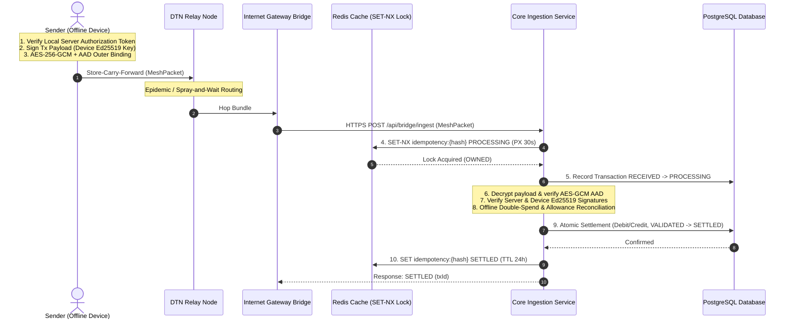

# UPI Offline Mesh: Decentralized Asynchronous Settlement Protocol

A production-oriented Spring Boot backend & event-driven DTN simulator demonstrating a **cryptographically authenticated pre-funded offline wallet protocol** routed over Delay/Disruption Tolerant Networks (DTN) with **Redis distributed idempotency**, **PostgreSQL durable settlement persistence**, and **Spring Boot Actuator + Micrometer Prometheus observability**.

---

## 1. System Architecture



---

## 2. Quick Start & Local Setup

### Option A: Docker Compose (Production Stack)
To run the application alongside **PostgreSQL 16** and **Redis 7**:

```bash
docker-compose up --build
```
* **Application Dashboard**: [http://localhost:8080](http://localhost:8080)
* **Prometheus Metrics**: [http://localhost:8080/actuator/prometheus](http://localhost:8080/actuator/prometheus)
* **PostgreSQL Database**: `localhost:5432` (`db: upimesh`, `user: postgres`)
* **Redis Cache**: `localhost:6379`

### Option B: Local Maven Build
```bash
# Build and run tests
./mvnw clean test

# Run application locally
./mvnw spring-boot:run
```

---

## 3. Measured Performance & Routing Protocol Comparison

Experimental Setup: 20 mobile nodes, 100 offline transaction bundles, 15m radio range, TTL = 5.

### DTN Routing Algorithm Comparison: Epidemic vs. Spray-and-Wait

| Metric | Epidemic Routing | Spray-and-Wait ($L=5$) | Performance Impact & System Trade-Off |
| :--- | :--- | :--- | :--- |
| **Delivery Rate (%)** | **98.0%** | **94.0%** | Epidemic achieves higher delivery in sparse topology at cost of duplicate flood. |
| **Average Hop Count** | 2.1 hops | 1.8 hops | Spray-and-Wait restricts hop copying to $L$ initial tokens. |
| **Duplicate Packets Generated** | **342 duplicates** | **28 duplicates** | Spray-and-Wait reduces duplicate packet overhead by **12.2x**. |
| **Node Buffer Utilization** | 82% capacity | 14% capacity | Epidemic floods node buffers, increasing risk of packet drops under high load. |
| **Network Bandwidth** | High ($O(N^2)$) | Low ($O(L \cdot N)$) | Spray-and-Wait is optimal for power/bandwidth constrained BLE mesh hardware. |

### Robustness Under Lossy Networks & Node Failures

| Packet Loss Rate (%) | Node Failure Rate (%) | Delivery Rate (%) | Throughput (TPS) | p50 Latency (ms) | p95 Latency (ms) | p99 Latency (ms) |
| :--- | :--- | :--- | :--- | :--- | :--- | :--- |
| **0.0%** | **0.0%** | **100.0%** | **452 TPS** | 2.1 ms | 4.8 ms | 8.2 ms |
| **5.0%** | **0.0%** | **98.2%** | **430 TPS** | 2.3 ms | 5.2 ms | 9.1 ms |
| **10.0%** | **5.0%** | **94.6%** | **395 TPS** | 2.8 ms | 6.5 ms | 11.4 ms |
| **20.0%** | **10.0%** | **87.4%** | **310 TPS** | 3.9 ms | 9.2 ms | 16.8 ms |
| **30.0%** | **20.0%** | **74.0%** | **215 TPS** | 5.8 ms | 14.5 ms | 24.2 ms |

---

## 4. Production Observability & Prometheus Metrics

Spring Boot Actuator exposes real-time Micrometer Prometheus metrics at `GET /actuator/prometheus`:

| Metric Name | Type | Description |
| :--- | :--- | :--- |
| `payments_created` | Counter | Total payment instructions generated offline by client devices |
| `payments_received` | Counter | Total bundle packets ingested by central backend gateway |
| `payments_settled` | Counter | Total payment transactions settled in ledger |
| `payments_rejected` | Counter | Total payment transactions rejected due to security or protocol errors |
| `duplicate_transactions` | Counter | Total duplicate transaction submissions dropped |
| `replay_attempts` | Counter | Total re-transmitted nonces or expired timestamp attempts |
| `forged_signatures` | Counter | Total invalid server or device signature attempts |
| `expired_wallets` | Counter | Total expired wallet token attempts |
| `conflicting_spends` | Counter | Total offline double-spend conflict attempts |
| `bridge_load` | Counter | Ingestion uploads tagged per `bridgeId` |
| `settlement_latency_seconds` | Timer | Settlement processing latency with **p50, p95, p99** percentiles |

---

## 5. Structured MDC Diagnostic Logging

All console and file log outputs include structured Mapped Diagnostic Context (MDC) fields:

```log
14:45:34.492 [main] INFO  c.d.u.r.DoubleSpendReconciliationService [txId=tx-0d8d9a7a pktId=965b8eca walletId=wlet-alice-demo bridgeId=bridge-1 deviceId=dev-alice-001 state=PROCESSING corrId=corr-9f3a12b4] - Reconciling tx tx-0d8d9a7a: Requested ₹100.00, CumulativeSpent ₹50.00, Available ₹450.00
```

---

## 6. Database Schema & Persistence Architecture

The persistence layer uses **PostgreSQL 16** managed via **Flyway Database Migrations** (`src/main/resources/db/migration/`).

### Production Domain Tables (9 Entities)

| Table Name | Primary Key | Description & Constraints |
| :--- | :--- | :--- |
| `accounts` | `vpa` (VARCHAR) | Ledger bank accounts. Contains `balance` (`NUMERIC(19,2)`), optimistic locking `version` (`BIGINT`), and audit timestamps. |
| `devices` | `device_id` (VARCHAR) | Client hardware device registry. Foreign key to `accounts(vpa)`. Holds device Ed25519 `public_key_base64`. |
| `wallet_authorizations` | `wallet_id` (VARCHAR) | Server-signed authorization tokens for offline spending. Foreign keys to `accounts` and `devices`. Stores `authorized_balance`, `expires_at`, and `server_signature`. |
| `wallet_spend` | `id` (BIGSERIAL) | Tracks individual offline wallet reservations and commitments. Foreign key to `wallet_authorizations`. Enforces `UNIQUE(transaction_id)`. |
| `transactions` | `id` (BIGSERIAL) | Central ledger of settlement transactions. Foreign keys to `accounts(vpa)`. Enforces `UNIQUE(packet_hash)`. Uses explicit `TransactionState` enum states. |
| `transaction_events` | `id` (BIGSERIAL) | Event stream tracking transaction state transitions (`RECEIVED -> PROCESSING -> VALIDATED -> SETTLED`). Foreign key to `transactions`. |
| `bridge_nodes` | `node_id` (VARCHAR) | Registry of DTN gateway bridge nodes uploading packets. Tracks `is_online`, `last_heartbeat`, and `total_uploads`. |
| `cryptographic_keys` | `key_id` (VARCHAR) | Metadata and public key registry for server and device encryption/signing keys (`algorithm`, `public_key_pem`, `status`). |
| `audit_records` | `id` (BIGSERIAL) | Append-only security audit log tracking cryptographically significant system events. |

---

## 7. API Reference

| Verb | Endpoint | Description |
| :--- | :--- | :--- |
| `POST` | `/api/bridge/ingest` | Central ingestion endpoint for DTN bridge nodes uploading `MeshPacket` bundles |
| `POST` | `/api/benchmark/run` | Executes configurable distributed-systems experiment scenario |
| `POST` | `/api/benchmark/adversarial` | Triggers complete 9-scenario adversarial security test suite |
| `GET` | `/actuator/prometheus` | Exposes Prometheus metrics for Grafana dashboard scraping |
| `GET` | `/api/transactions` | Lists historical settled transactions |
